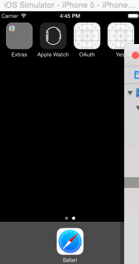

## Twitter [(raw)](https://gist.githubusercontent.com/timothy1ee/b9b1860c8ecb4b0b1c18/raw/2adc3f63677d81644e00245cee891eee88907767/gistfile1.md)

This is a basic twitter app to read and compose tweets the [Twitter API](https://apps.twitter.com/).
We've added some new features this week
Time spent: 6 hours

#### Required
Completed all:
Hamburger menu
Dragging anywhere in the view should reveal the menu.
The menu should include links to your profile, the home timeline, and the mentions view.
The menu can look similar to the LinkedIn menu below or feel free to take liberty with the UI.
Profile page
Contains the user header view
Contains a section with the users basic stats: # tweets, # following, # followers
Home Timeline
Tapping on a user image should bring up that user's profile page

### Walkthrough

